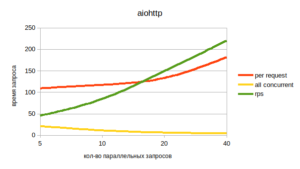
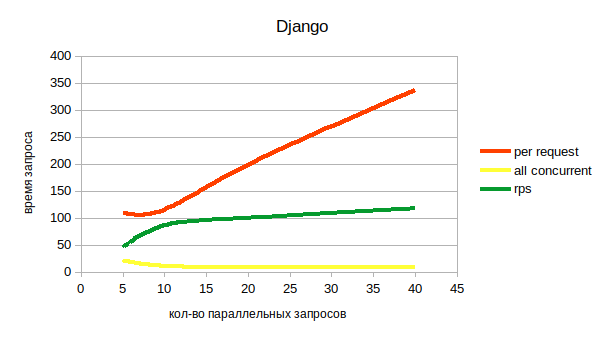
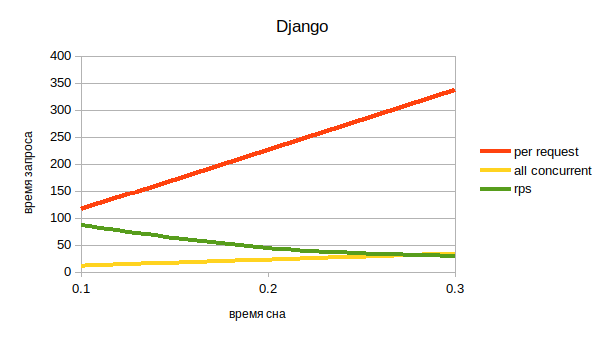
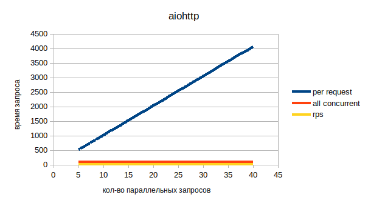

# Django vs aiohttp
rps (Requests per second) — среднее количество обработанных в секунду запросов.

per request (Time per request) — среднее время обработки запроса.

all concurent — среднее время обработки запроса учитывая конекурентность.

#### Сравнение производительности aiohttp и django при увеличении количества параллельных запросов

`ab -n 100 -c <Число параллельных соединений> http://127.0.0.1:<номер порта приложения>/`

Выводы:     
При увеличении количества одновременных клиентов в aiohttp время на выполнение
запроса незначительно увеличивается, при этом количество запросов которые может выдержать
сервер увеличивается.       
У Django время на выполнение запроса значительно больше чем у aiohttp.

#### Сравнение производительности aiohttp и django при увеличении времени io bound операции

`ab -n 100 -c 10 http://127.0.0.1:<номер порта приложения>/`

При увеличении времени выполнения io-операций увеличивается время на
выполнение запроса, уменьшается способность одновременно обслуживать несколько
запросов, ситуация похожая у aiohttp и Django

#### Сравнение производительности aiohttp и django при увеличении количества параллельных запросов, если в aiohttp использовать синхронную операцию.
`ab -n 100 -c <Число параллельных соединений> http://127.0.0.1:<номер порта приложения>/`

При выполнение в коде синхронных операций aiohttp по производительности
ухудшается в разы.
